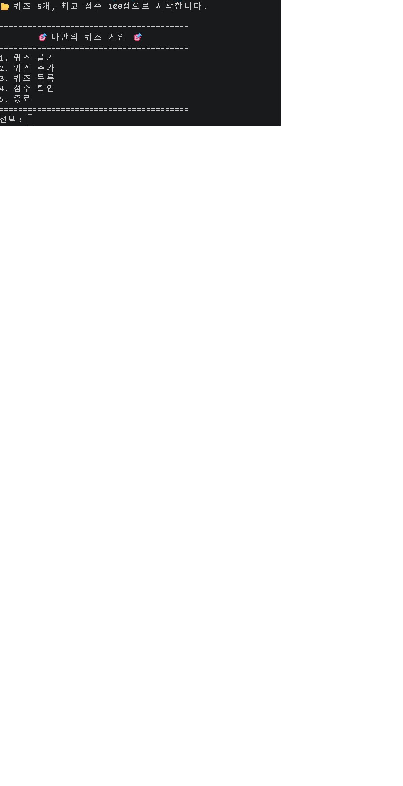
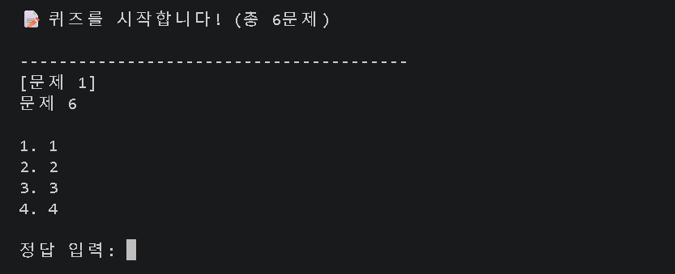
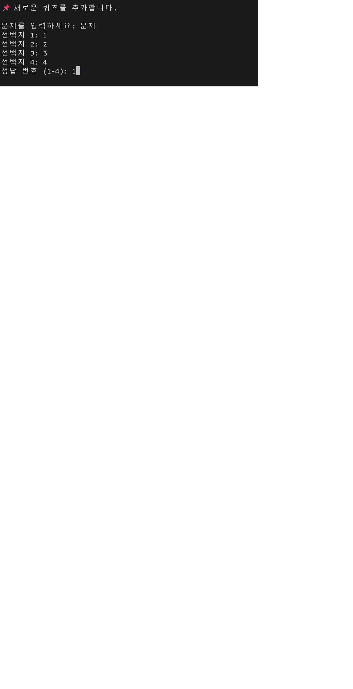
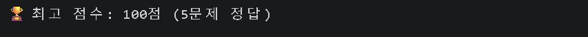

# 🎯 나만의 퀴즈 게임

터미널에서 동작하는 파이썬 콘솔 퀴즈 게임입니다.
퀴즈를 풀고, 직접 등록하고, 최고 점수를 기록할 수 있으며, 프로그램을 종료했다가 다시 실행해도 데이터가 그대로 유지됩니다.

---

## 1. 프로젝트 개요

Python 기본 문법과 객체 지향(클래스)을 사용해 하나의 완성된 프로그램을 처음부터 끝까지 구현한 학습 프로젝트입니다.

- **입력/출력 흐름**: 메뉴 선택 → 기능 실행 → 다시 메뉴로 돌아오는 반복 구조
- **역할 분리**: 퀴즈 데이터(`Quiz`), 점수 관리(`Score`), 화면 입출력(`IO`), 출제 순서 섞기(`randomQuiz`)로 클래스를 나눔
- **데이터 영속성**: 퀴즈 목록과 최고 점수를 `state.json`에 저장/불러오기
- **버전 관리**: 기능 단위로 커밋하고, 브랜치를 나눠 작업한 뒤 `main`에 병합

외부 라이브러리는 사용하지 않고 표준 라이브러리(`json`, `os`, `sys`, `random`)만 사용했습니다.

---

## 2. 퀴즈 주제와 선정 이유

> ⚠️ **작성 필요**: 아래 내용을 본인이 `state.json`에 넣은 주제에 맞게 수정하세요.

**주제**: (예: 프로그래밍 기초 / 영화 / 게임 등)

**선정 이유**:
- (예) 평소 관심 있는 분야라 문제와 선택지를 직접 만들기 수월했다.
- (예) 정답이 명확하게 갈리는 4지선다 문제를 만들기 좋은 주제라고 판단했다.
- (예) 나중에 문제를 계속 추가하면서 스스로 복습용으로도 쓸 수 있다.

기본 퀴즈는 5개 이상 포함되어 있으며, 실행 중 "퀴즈 추가" 기능으로 계속 늘려갈 수 있습니다.

---

## 3. 실행 방법

### 요구 환경
- Python 3.10 이상 (`match` 문 사용)

```bash
python3 --version
```

### 실행

```bash
git clone https://github.com/Rhw0213/<저장소명>.git
cd <저장소명>
python3 main.py
```

프로젝트 루트에서 실행해야 `state.json`을 정상적으로 읽고 쓸 수 있습니다.

---

## 4. 기능 목록

| 번호 | 기능 | 설명 |
|:---:|---|---|
| 1 | 퀴즈 풀기 | 저장된 퀴즈를 랜덤 순서로 출제하고, 정답/오답을 즉시 알려줍니다. 문제당 20점이며 결과와 최고 점수 갱신 여부를 표시합니다. |
| 2 | 퀴즈 추가 | 문제, 선택지 4개, 정답 번호를 입력받아 새 퀴즈를 등록합니다. |
| 3 | 퀴즈 목록 | 등록된 퀴즈의 문제를 번호와 함께 나열합니다. |
| 4 | 점수 확인 | 저장된 최고 점수와 몇 문제를 맞혔는지 확인합니다. |
| 5 | 종료 | 현재 퀴즈 목록과 최고 점수를 `state.json`에 저장한 뒤 종료합니다. |

### 입력 예외 처리
- 입력값의 앞뒤 공백을 제거한 뒤 처리합니다. (`" 1 "` → `1`)
- 숫자로 변환할 수 없는 입력(`abc`, 빈 입력)은 안내 메시지를 출력하고 다시 입력받습니다.
- 허용 범위를 벗어난 숫자는 안내 메시지를 출력하고 다시 입력받습니다.

### 보너스 구현
- ✅ **랜덤 출제** — `randomQuiz` 클래스에서 `random.shuffle`로 원본 목록을 훼손하지 않고 복사본을 섞어 출제합니다.

---

## 5. 파일 구조

```
.
├── main.py          # 진입점. Game() 호출
├── quizGame.py      # 게임 전체 흐름(메뉴 분기, 퀴즈 풀기/추가/목록/점수, JSON 저장·불러오기)
├── quiz.py          # Quiz 클래스 — 개별 퀴즈의 문제/선택지/정답과 출력·채점
├── score.py         # Score 클래스 — 현재 점수, 맞힌 개수, 최고 점수 관리
├── IO.py            # IO 클래스 — 메뉴 출력, 숫자/문자열 입력 검증, 결과 화면 출력
├── randomQuiz.py    # randomQuiz 클래스 — 출제 순서 섞기
├── state.json       # 퀴즈 데이터와 최고 점수 저장 파일
├── .gitignore
└── README.md
```

### 클래스별 역할

- **`Quiz`** — 퀴즈 한 개를 표현합니다.
  - 속성: `question`(문제), `choices`(선택지 4개 리스트), `answer`(정답 번호 1~4)
  - 메서드: `print()` 문제와 선택지 출력, `solve()` 정답 확인, `to_dict()` 저장용 딕셔너리 변환
- **`Score`** — 점수를 관리합니다.
  - 속성: `score`(현재 점수), `solveQuiz`(맞힌 개수), `best_score`(최고 점수), `newRecord`(신기록 여부)
  - 메서드: `increaseScore()`, `findBestScore()`, `init()` 등
- **`IO`** — 화면 출력과 입력 검증을 담당합니다.
  - `print_title()`이 메뉴를 출력하고 올바른 번호가 들어올 때까지 반복합니다.
  - `inputNum()`, `isValidNumber()`가 숫자 변환 실패와 범위 초과를 걸러냅니다.
- **`randomQuiz`** — 퀴즈 목록의 복사본을 섞어 반환합니다.

---

## 6. 데이터 파일 설명 (`state.json`)

- **경로**: 프로젝트 루트 `./state.json`
- **인코딩**: UTF-8 (`ensure_ascii=False`로 한글이 그대로 저장됩니다)
- **역할**: 등록된 퀴즈 목록과 최고 점수를 저장해, 프로그램을 종료했다가 다시 실행해도 데이터가 유지되도록 합니다.
- **저장 시점**: 메뉴에서 `5. 종료`를 선택할 때 현재 상태 전체를 덮어씁니다.
- **불러오기 시점**: 프로그램 시작 시 한 번 읽어 `Quiz` 객체 리스트와 `Score` 객체를 만듭니다.

### 스키마

| 필드 | 타입 | 설명 |
|---|---|---|
| `quizzes` | `list[dict]` | 퀴즈 목록 |
| `quizzes[].question` | `str` | 문제 텍스트 |
| `quizzes[].choices` | `list[str]` | 선택지 4개 |
| `quizzes[].answer` | `int` | 정답 번호 (1~4) |
| `best_score` | `int` | 최고 점수 (문제당 20점) |

### 예시

```json
{
    "quizzes": [
        {
            "question": "Python의 창시자는?",
            "choices": ["Guido", "Linus", "Bjarne", "James"],
            "answer": 1
        }
    ],
    "best_score": 80
}
```

---

## 7. 실행 화면

| 화면 | 캡처 |
|---|---|
| 메뉴 | `docs/screenshots/menu.png` |
| 퀴즈 풀기 | `docs/screenshots/play.png` |
| 퀴즈 추가 | `docs/screenshots/add_quiz.png` |
| 점수 확인 | `docs/screenshots/score.png` |

```markdown




```

---

## 8. Git 작업 기록

- 기능 단위 커밋 (`Feat:`, `Fix:`, `Docs:`, `Refactor:` 접두사 사용)
- 퀴즈 풀기 기능은 별도 브랜치에서 작업 후 `main`에 병합
- 원격 저장소를 별도 디렉터리에 `clone`하여 변경 → `push`한 뒤, 기존 작업 디렉터리에서 `pull`로 반영 확인

```bash
git log --oneline --graph
```
